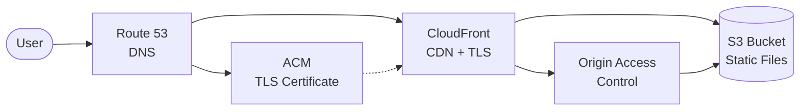
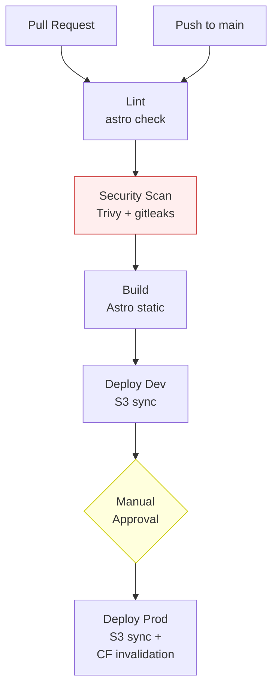
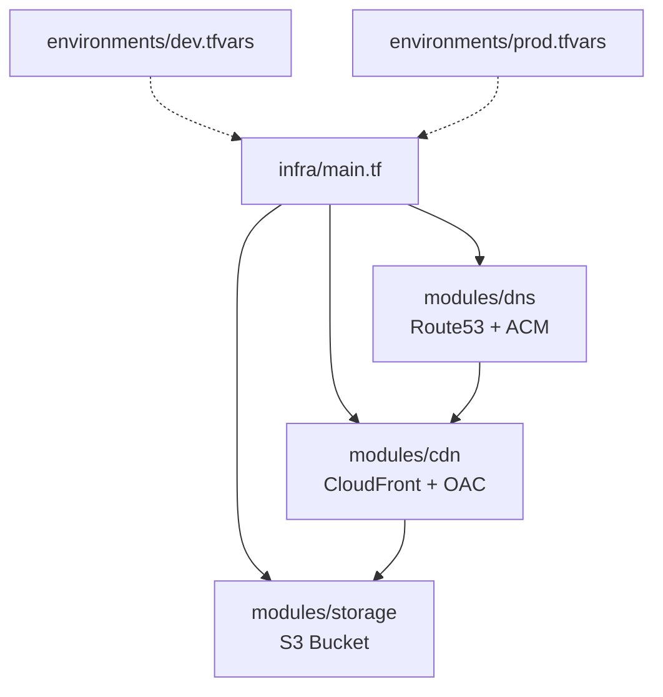

# Architecture

This document describes the infrastructure and deployment architecture of the PortfolioSite project.

## Hosting Architecture

The site is hosted entirely on AWS using a standard static site pattern:

### Components

| Component | Purpose | Key Config |
|-----------|---------|-----------|
| **Route 53** | DNS resolution for the custom domain | A record aliased to CloudFront |
| **ACM** | TLS certificate for HTTPS | DNS-validated, auto-renewed |
| **CloudFront** | CDN, TLS termination, caching | OAC for S3 access, `TLSv1.2_2021` minimum |
| **S3** | Static file storage | Public access blocked, served only via CloudFront OAC |

### Security Design

- **S3 public access is fully blocked** — no direct access to the bucket
- **CloudFront Origin Access Control (OAC)** restricts bucket access to the specific distribution
- Content served over **HTTPS only** (`redirect-to-https` viewer protocol policy)
- Minimum TLS version enforced at **TLSv1.2_2021**

## CI/CD Pipeline

### Workflow Files

| Workflow | Trigger | Purpose |
|----------|---------|---------|
| `ci.yml` | Push / PR to `main` | Lint, Trivy scan, gitleaks, build |
| `deploy.yml` | Push to `main` / manual dispatch | Deploy to dev (auto) or prod (approval) |
| `iac.yml` | Changes to `infra/` / manual dispatch | Terraform plan (auto) and apply (manual) |

## Infrastructure as Code

### Module Design

A single set of Terraform modules serves both environments. Environment-specific values are injected via `.tfvars` files:

| Module | Resources | Notes |
|--------|-----------|-------|
| `storage` | `aws_s3_bucket`, website config, public access block, bucket policy | Policy scoped to specific CloudFront distribution ARN |
| `cdn` | `aws_cloudfront_distribution`, `aws_cloudfront_origin_access_control` | Uses OAC (not deprecated OAI) |
| `dns` | `aws_route53_zone`, A record, `aws_acm_certificate`, DNS validation | Cert must be in `us-east-1` for CloudFront |

### State Management

- **Backend:** [Terraform Cloud](https://app.terraform.io) (org: `RyanAPLearning`)
- **Execution:** Remote — plans and applies run on TFC infrastructure
- **Workspaces:** `PersonalSite-dev` and `PersonalSite-prod` (selected via `TF_WORKSPACE` or tags)
- **Locking:** Built-in (TFC manages state locking automatically)
- **AWS Credentials:** Stored as workspace variables in TFC (not in GitHub Actions)

## Environments

| Environment | Domain | CloudFront | Deploy Trigger |
|-------------|--------|-----------|----------------|
| **Dev** | dev.ryanaparedes.com | Yes | Auto on push to `main` |
| **Prod** | ryanaparedes.com | Yes | Manual with approval gate |
